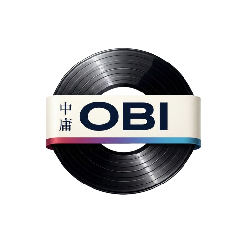
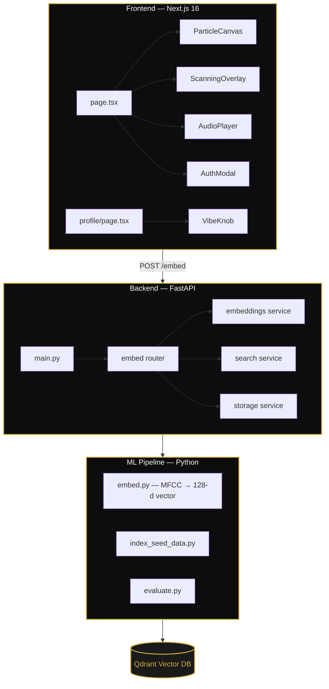

<p align="center">
  
</p>

<h1 align="center">OBI</h1>

<p align="center">
  <strong>The Sonic Search Engine</strong><br/>
  <em>Shazam for producers — search for sounds the way you hear them.</em>
</p>

<p align="center">
  <a href="#about">About</a> •
  <a href="#features">Features</a> •
  <a href="#architecture">Architecture</a> •
  <a href="#tech-stack">Tech Stack</a> •
  <a href="#getting-started">Getting Started</a> •
  <a href="#contributing">Contributing</a> •
  <a href="#license">License</a>
</p>

<p align="center">
  <a href="https://nextjs.org/"></a>
  <a href="https://react.dev/"></a>
  <a href="https://fastapi.tiangolo.com/"></a>
  <a href="https://qdrant.tech/"></a>
  <a href="https://tailwindcss.com/"></a>
  <a href="LICENSE"></a>
</p>

<br/>

---

## About

**OBI** is an audio-similarity search engine built for music producers, sound designers, and sample hunters. Instead of browsing through endless folders or typing keywords into a traditional search bar, OBI lets you find sounds by _describing a vibe_, _uploading a clip_, or _recording a snippet straight from your mic_.

Think **Shazam, but for producers** — you feed it audio DNA and it finds you the sounds you're hearing in your head.

<br/>

## Features

**Multi-Modal Search** — Search three ways from one interface: type a vibe (_"dusty jazz drums from the 70s"_), upload a `.wav`/`.mp3`, or record a snippet directly in-browser.

**Custom Waveform Player** — Hand-built SVG audio player with 48-bar visualization, gold fill progress tracking, and click-to-seek.

**Cinematic Scan Animation** — Full-screen overlay with expanding ripple rings, counter-rotating arcs, a breathing visualizer orb, and phased status text on a 3.2-second choreography.

**ML Embedding Pipeline** — MFCC-based audio fingerprinting converts any sound into a 128-dimensional vector for cosine similarity search via Qdrant.

<br/>

## Architecture



<br/>

## Tech Stack

| Layer         | Technology                       | Purpose                                         |
| ------------- | -------------------------------- | ----------------------------------------------- |
| **Frontend**  | Next.js 16, React 19, TypeScript | App Router, SSR, type-safe UI                   |
| **Styling**   | Tailwind CSS v4                  | Utility-first styling                           |
| **Animation** | Framer Motion 12                 | Page transitions, scanning overlay, orb effects |
| **Audio**     | Custom SVG + Canvas              | Waveform rendering and particle system          |
| **Backend**   | Python, FastAPI                  | REST API, audio processing orchestration        |
| **ML**        | librosa, MFCC → CLAP             | Audio feature extraction and embedding          |
| **Vector DB** | Qdrant                           | High-speed cosine similarity search             |
| **Storage**   | Supabase                         | Audio file hosting                              |
| **Hosting**   | Vercel, Modal, Railway           | Serverless deployment                           |

<br/>

## Getting Started

<details>
<summary><strong>Prerequisites</strong></summary>
<br/>

- **Node.js** ≥ 20
- **Python** ≥ 3.10
- **pnpm** (recommended) or npm

</details>

<details>
<summary><strong>Frontend</strong></summary>
<br/>

```bash
cd frontend
pnpm install
pnpm dev
```

Runs at `http://localhost:3000`.

</details>

<details>
<summary><strong>Backend</strong></summary>
<br/>

```bash
cd backend
python -m venv venv
source venv/bin/activate   # Windows: venv\Scripts\activate
pip install -r requirements.txt
uvicorn app.main:app --reload
```

API at `http://localhost:8000` — health check: `GET /health`.

</details>

<details>
<summary><strong>ML Pipeline</strong></summary>
<br/>

```bash
cd ml
pip install -r requirements.txt

python embed.py path/to/audio.wav        # Embed a single file
python index_seed_data.py                # Index seed data into Qdrant
python evaluate.py path/to/query.wav     # Evaluate search quality
```

</details>

<br/>

## Contributing

Contributions are welcome — read the [Contributing Guide](CONTRIBUTING.md) before opening a PR.

<br/>

## License

MIT — see [LICENSE](LICENSE) for details.
